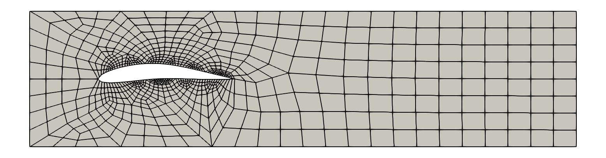
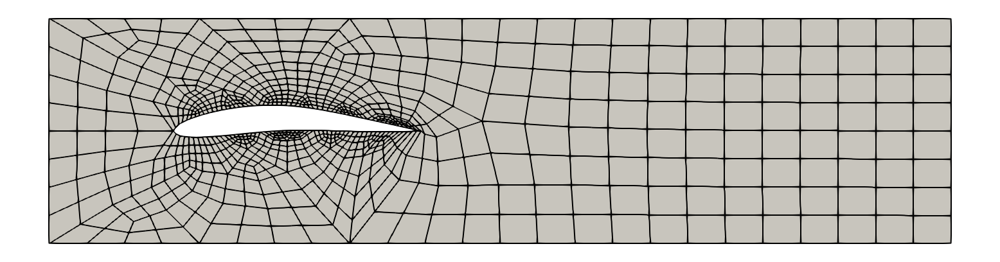
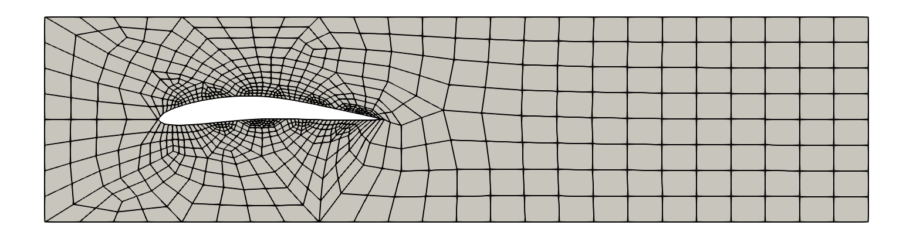
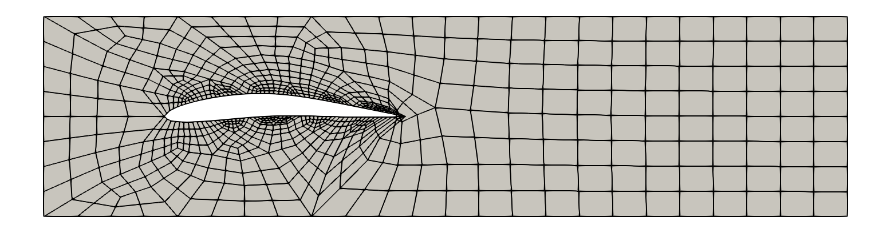
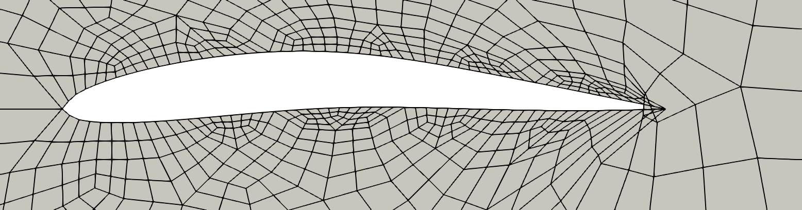

## Airfoil Deformation ##

In this tutorial we consider the deformation of an airfoil in a rectangular domain. 
The deformation is only applied to the airfoil and not to the whole domain.
We use the harmonic mesh motion and the linear elastic motion to deform the airfoil. We compare the results for two different displacements of the airfoil.

### 1. Problem statement

Consider a rectangular domain $\Omega_1$ with vertices (0, 0) -- (0, 1) -- (4, 1) -- (4, 0). In this rectangular domain we define an airfoil using the following parametrisation adapted from (Lu et al., [2018](https://doi.org/10.1016/j.ast.2018.04.025)).

The airfoil $\Omega_2$ is defined as the surface betweeen the upper curve 
$ (0.5+x_c(k), 0.5 + y_c(k) + t(x_c)(k)) $ and the lower curve $(0.5+x_c(k), 0.5 + y_c(k) - t(x_c)(k))$ with $k \in [0,1]$. Here, $t(x_c)(k)$ is the thickness of the airfoil and $(x_c(k), \ y_c(k))$ is the camber line of the airfoil. The thickness and camber line are parametrised as follows, using data from the NACA 2412 airfoil: 

$$t(x) = 0.6 (0.2969 \sqrt{x} - 0.126 x - 0.3516 x^{2}+ 0.2843 x{3} - 0.1036 x^{4})$$

$$x_c(k) = 1.5 k (1-k)^{2} + 1.5 * (1-k) k^{2} + k^{3}$$

$$y_c(k) = 0.3 k (1-k)^{2} + 0.15 * (1-k) k^{2}$$

We define the boundary of the outer rectangular $\Gamma_1 = \partial \Omega_1$ and the boundary of the airfoil $\Gamma_2 = \partial \Omega_2$.

We define the reference domain $ \Omega = \Omega_1 \backslash \Omega_2$ and the corresponding mesh as reference mesh.
The mesh consists of irregular quadrilaterals and is unstructured. In the neighbourhood of the airfoil we use a refined mesh.
A visualization of the reference mesh is given below.

In all cases we use homogeneous Dirichlet boundary values to describe the fixed boundary of the rectangel. This can be described by zero-displacement boundary conditions:

On $\Gamma_1: \ (0, \ 0)$

For the deformation of the airfoil we define two types of boundary conditions, varying in the displacement factor:

Version 1 on $\Gamma_2: \ (0.1 x, \ 0)$

Version 2 on $\Gamma_2: \ (0.2 x, \ 0)$

### 2. Implementation

We use two types of deformation algorithms. The first one is the harmonic mesh motion given in ```harmonic_airfoil_deformation.py```. The second one is the linear elastic motion given in ```linear_elastic_airfoil_deformation.py```. We refer to the matching tutorials in the demo folder for more details on the implementation of these methods.

The mesh generation file is given in ```mesh_data/mesh.py``` which stores the mesh in the same directory.

### 3. Results

The constructed reference mesh is visualized in the following figure, where the computational domain is indicated in grey.



**Version 1**

Using Version 1 as displacement of the airfoil we obtain the following results for the harmonic mesh motion:



For the linear elastic motion we obtain similar results:




**Version 2**

Using the Version 2 as displacement with a larger displacement factor we obtain a mesh with skewed elements at the tail of the airfoil.



Zooming in on the airfoil, this fact is inevitable:



This is also the case for the linear elastic motion.

**Remark**

We note that by using complex shapes in computational domains and too large deformations with respect to the mesh element size, the mesh quality can be affected negatively, leading to skewed elements. This is independent from the used method.

Skewed elements can be avoided by deforming the whole computational domain, more precicely by explicitly defining inhomogeneous dirichlet boundary values for the boundary of the rectangle. Another possible workaround is to use homogeneous Neumann boundary values for the boundary of the rectangle. Both of these approaches lead to a deformed computational domain and not just a deformed airfoil.
